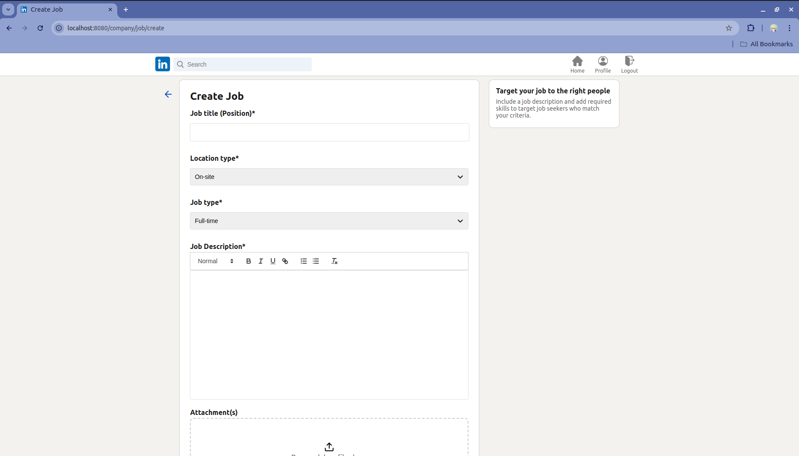
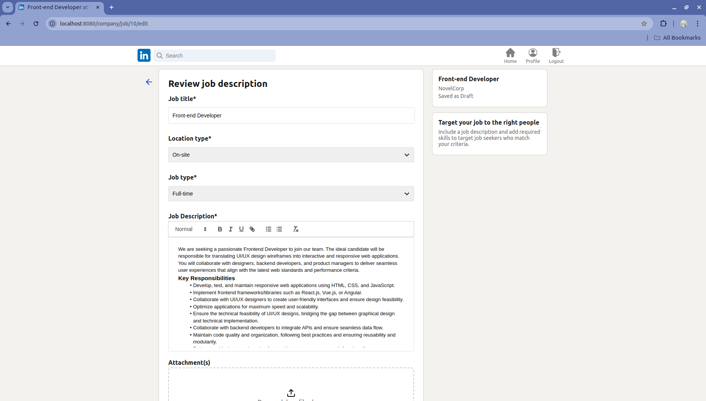

# Description

Introducing, LinkinPurry, The simple copy of linkedin website application.

# Table Of Contents

- [Description](#description)
- [Table Of Contents](#table-of-contents)
- [Author](#author)
- [Specifications](#specifications)
- [Requirements](#️requirements)
- [How to Run](#how-to-run)
- [Screenshots of the Application](#screenshots-of-the-application)
- [Task Distribution](#task-distribution)

# Author

|   NIM    |           Nama           |
| :------: | :----------------------: |
| 13522066 | Nyoman Ganadipa Narayana |
| 13522072 |   Ahmad Mudabbir Arif    |
| 13522096 | Novelya Putri Ramadhani  |

# Specifications

# ✨ Wajib

All required specifications are done.

# ✨ Bonus

| Bonus              | Done |
| ------------------ | ---- |
| All Responsive Web | ✅   |
| UI/UX Linkedin     | ✅   |
| Data Export (CSV)  | ✅   |
| Google Lighthouse  | ✅   |

# Requirements

Tested by the authors on the following environment:

1. Docker version 27.3.1 (to run the web app)
2. PHP 8.4.0RC1 (to run the scripts)
3. pdo_pgsql installed.

Hence, the later version of those will be supported for this repo.
The second one and the third one is not needed if you want to run the script from inside the docker container. Also, we must set the environments variable by doing

1. Fill in the docker environment

```bash
  cp php/.env.docker.template php/.env.docker
```

then fill in the blanks inside the php/.env.docker

2. Fill in the local environment

```bash
cp php/.env.local.template php/.env.local
```

Then fill in the blanks inside the php/.env.local

Then, we're good to go!

# How to install the requirements

1. Docker, visit https://docs.docker.com/engine/install/, then follow the steps there based on your operating system.
2. PHP, visit https://www.php.net/manual/en/install.php, then follow the steps there based on your operating system.
3. pdo_pgsql

- for windows, add the following line to your php.ini

```bash
extension=pdo_pgsql
```

- for ubuntu, run the following from your CLI

```bash
sudo apt update
sudo apt install php-pgsql
```

- for others, search up on the internet on how to add postgres driver for php.

# How To Run

1. Run the application and the database

```bash
make server
```

Alternatively, you can use

```bash
docker compose up app-docker-php
```

2. Database is not yet set, run the following migrations (make sure your username is `user`)

```bash
make migrations
```

Alternatively, you can run the script inside the docker container then run the script.

Now, the linkinpurry web app is ready! at http://localhost:8080

# Screenshots of the Application

**Login Page**
   

**Register Page**
   

**Not Logged In**
   

## As Company

1. **Company Home**
   

2. **Company Profile**
   

3. **Edit Company Profile**
   

4. **Post a Job**
   

5. **Edit Job**
   

6. **Job Detail (Company View)**
   

7. **Job Detail 2 (Company View)**
   

8. **Application Detail (Company View)**
   

## As Job Seeker

1. **Home**
   

2. **Job Detail (Job Seeker View)**
   

3. **Apply for Job**
   

4. **After Apply**
   

5. **Application History**
   

# Task Distribution

We made a great team! one task is not purely done alone

## Server side

(Wajib)

1. Route, architecture, docker: 13522066
2. Login: 13522066
3. Register: 13522066
4. Home: 13522066, 13522072
5. Tambah Lowongan: 13522066, 13522072, 13522096
6. Detail Lowongan: 13522066, 13522072, 13522096
7. Detail Lamaran: 13522072
8. Edit Lowongan: 13522066, 13522072, 13522096
9. Lamaran: 13522066
10. Riwayat: 13522072, 13522096
11. Profil: 13522072, 13522096

(Bonus)

1. Data Export: 13522066
2. Google Light House: 13522066, 13522072, 13522096

## Client side

(Wajib)

1. Login: 13522066
2. Register: 13522066
3. Home: 13522072
4. Tambah Lowongan: 13522072
5. Detail Lowongan: 13522066, 13522072
6. Detail Lamaran: 13522072
7. Edit Lowongan: 13522072
8. Lamaran: 13522066
9. Riwayat: 13522072, 13522096
10. Profil: 13522072, 13522096

(Bonus)

1. All Responsive: 13522066, 13522072
2. UI/UX Linkedin: 13522066, 13522072, 13522096
3. Data Export: 13522066
4. Google Light House: 13522066, 13522072, 13522096
